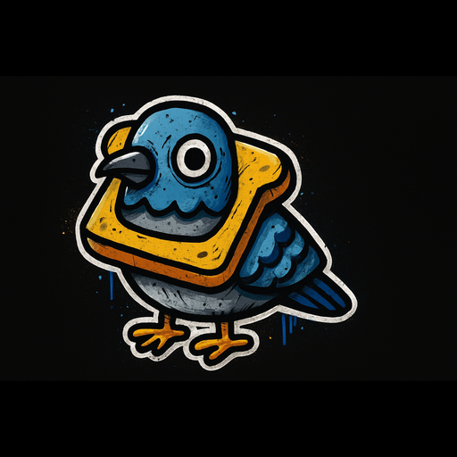

<h1 align="center">
  <br/>
  Piccione
</h1>

<p align="center">
  <em>A native Signal client for macOS, Linux and Windows.<br/>
  Written in Rust + Svelte. Not Electron.</em>
</p>

<p align="center">
  <a href="https://github.com/calibrae/piccione/releases"></a>
  <a href="#"></a>
  <a href="#"></a>
  <a href="LICENSE"></a>
</p>

---

## What is this

Apple's Signal client runs on Electron — that's a full Chromium VM whose job
is to display a list of messages. Piccione is the lean version: a single
native binary, a native WebKit WebView for rendering, an encrypted SQLite
store for state, and just enough Rust to wire it all to Signal's servers.

On a 2024 MacBook the cold-start physical footprint is **~100 MB**.
Signal Desktop on the same machine sits at 350-500 MB. We don't ship
JavaScript runtimes we don't use.

## What it does

- 🔗 **Pair as a secondary device** by scanning the QR with your phone's
  Signal app. No phone-number registration; your primary stays where it is.
- 💬 **Send and receive** text + attachments in 1:1 and group conversations.
- 📚 **Sync contacts from Signal Storage Service** — the modern server-stored
  encrypted contact list, not the deprecated legacy `SyncMessage::Contacts`
  stub. Implemented from scratch in Rust as part of this project; PRs
  pending against the `whisperfish/presage` and `whisperfish/libsignal-service-rs`
  upstream projects.
- ✓ **Two-way delivery + read receipts**. Outgoing bubbles show ✓ → ✓✓
  → ✓✓ (blue); we send receipts back so your contacts see the same on
  their side. Toggle off in Settings if you don't want senders to know
  you've read their messages.
- 🖼 **Media browser** per conversation — every image + file you've ever
  exchanged, lazily loaded into a grid, with a built-in lightbox.
- 🎨 **Light / dark / system theme**.
- 🔒 **Encrypted at rest** — SQLCipher with a 32-byte hex passphrase
  stored in `~/Library/Application Support/app.piccione/.db_key` at mode
  0600. Encrypted APFS volume + user-only file permissions.

## What it doesn't do (yet)

- Voice / video calls — those need libsignal's RingRTC bindings, not
  there yet.
- Stories, stickers, sticker packs.
- Editing the contact list — Piccione is read-only against Signal
  Storage Service for v0.x. Add / remove contacts from your phone's
  Signal app.
- Multi-account.
- Sealed-sender V2 indicators (we accept, we don't surface).
- Notifications (`tauri-plugin-notification` is not wired yet).

## Stack

| Layer | Choice | Why |
|---|---|---|
| Shell | [Tauri 2](https://tauri.app/) | Native WebKit on macOS, native WebView2 on Windows, native WebKitGTK on Linux. ~10 MB binaries. |
| UI | [Svelte 5](https://svelte.dev/) + TypeScript | Runes (`$state`, `$derived`), small bundles, reactive by default. |
| Signal protocol | [`presage`](https://github.com/whisperfish/presage) (`main`) | Only pure-Rust Signal client lib worth building on. We patch it (storage-service branch) until our PRs land. |
| Storage | [`presage-store-sqlite`](https://github.com/whisperfish/presage/tree/main/presage-store-sqlite) | SQLCipher via [`libsqlite3-sys`](https://github.com/whisperfish/rusqlite) fork. |
| Crypto | [`libsignal`](https://github.com/signalapp/libsignal) v0.91 | The real Signal protocol primitives. |
| Allocator | [`mimalloc`](https://github.com/microsoft/mimalloc) | macOS's default malloc holds onto freed pages forever. mimalloc returns them to the OS. |

## Memory

| Process | `ps` RSS (over-counted) | Physical footprint |
|---|---|---|
| `piccione` (Rust core) | ~125 MB | **~42 MB** |
| WebKit.GPU | 30 MB | 11 MB |
| WebKit.Networking | 24 MB | ~6 MB |
| WebKit.WebContent | 67 MB | 41 MB |
| **Total** | **~244 MB** | **~100 MB** |

`ps` over-counts because it includes the shared read-only system framework
mappings (`__TEXT`, `__OBJC_RO`, `__LINKEDIT`) in every process's RSS even
though they're physically loaded once for the whole machine. Activity
Monitor's "Memory" column and `vmmap --summary` report the honest number.
See [`inbox/memory-accounting.md`](inbox/memory-accounting.md) for the
full breakdown.

## Building from source

### Prereqs

| Platform | Need |
|---|---|
| macOS | Xcode CLT, Node 20+, Rust stable, `cargo install tauri-cli@2` |
| Linux | `libwebkit2gtk-4.1-dev`, `libgtk-3-dev`, `libssl-dev`, `librsvg2-dev`, `libayatana-appindicator3-dev`, Node 20+, Rust stable |
| Windows | Visual Studio Build Tools (Desktop C++ workload), WebView2 (preinstalled on Win11), Node 20+, Rust stable |

### Dev loop

```bash
git clone https://github.com/calibrae/piccione.git
cd piccione
npm install
npm run tauri dev
```

Vite serves the frontend on `localhost:1420`; Tauri spawns the Rust core
and hosts it inside a native WebView. Hot reload works for the Svelte
side; Rust changes trigger a `cargo build` + relaunch.

### Production bundle

```bash
npm run tauri build
```

Produces a signed-ready bundle at `src-tauri/target/release/bundle/<platform>/`:

- macOS → `.app` + `.dmg`
- Linux → `.deb`, `.rpm`, `.AppImage`
- Windows → `.msi`

Signing + notarisation for macOS distribution requires the env vars listed
in `.github/workflows/release.yml`. CI does this automatically on `v*` tag push.

## Project layout

```
src/                          Svelte 5 frontend
  App.svelte                  root: loading → LinkDevice or ChatLayout
  lib/
    components/
      ChatLayout.svelte       conversation list + thread + new-message
      LinkDevice.svelte       QR provisioning screen
      MediaBrowser.svelte     per-conversation attachment grid + lightbox
      Settings.svelte         privacy + theme + sign-out modal
      ToastContainer.svelte
    stores/
      messaging.svelte.ts     conversations, messages, receipts, typing
      provisioning.svelte.ts  link-device state machine
      settings.svelte.ts      light/dark/auto + privacy flags
    types.ts
src-tauri/
  src/
    lib.rs                    Tauri Builder, command registration, startup
    app_state.rs              AppState { ProvisioningManager, MessagingService, Settings, ... }
    commands/                 #[tauri::command] wrappers
    provisioning/             link_secondary_device + state machine
    messaging/                receive loop, send queue, contacts/groups/messages reads
    settings.rs               persisted user preferences
    store/keychain.rs         passphrase storage
  bin/piccione_cli.rs         signalui-cli equivalent (pair/paired/devices)
inbox/
  storage-service-research.md How Signal Storage Service works + what we built
  memory-accounting.md        Why ps lies about Cocoa app RSS
```

## Contributing

This was a 3-day build by one person. PRs welcome but the bar is "explain
what you're doing in the commit message so someone reading it in 18 months
gets the why". No co-author lines from AI assistants in commit messages.

If your change touches one of the patched dependencies (presage or
libsignal-service-rs, both pinned to forks on [`calibrae`](https://github.com/calibrae)),
PR there first — those are what the upstream projects will see.

## Acknowledgements

- [Whisperfish](https://gitlab.com/whisperfish/whisperfish) — the
  longest-running open-source Rust Signal client, the people behind
  `presage` and `libsignal-service-rs`, and the reason any of this
  works.
- [SignalApp](https://github.com/signalapp) for shipping `libsignal`
  with usable Rust bindings.
- [Tauri](https://tauri.app/) for proving you can ship a desktop app
  without bundling Chromium.
- [Sticker pigeon](src-tauri/icons/icon.png) for being the right mascot
  on the first try.

## License

[AGPL-3.0](LICENSE). Same as Signal-Android and Signal-Desktop. Not Apple's
fault if they don't accept this in the Mac App Store.
